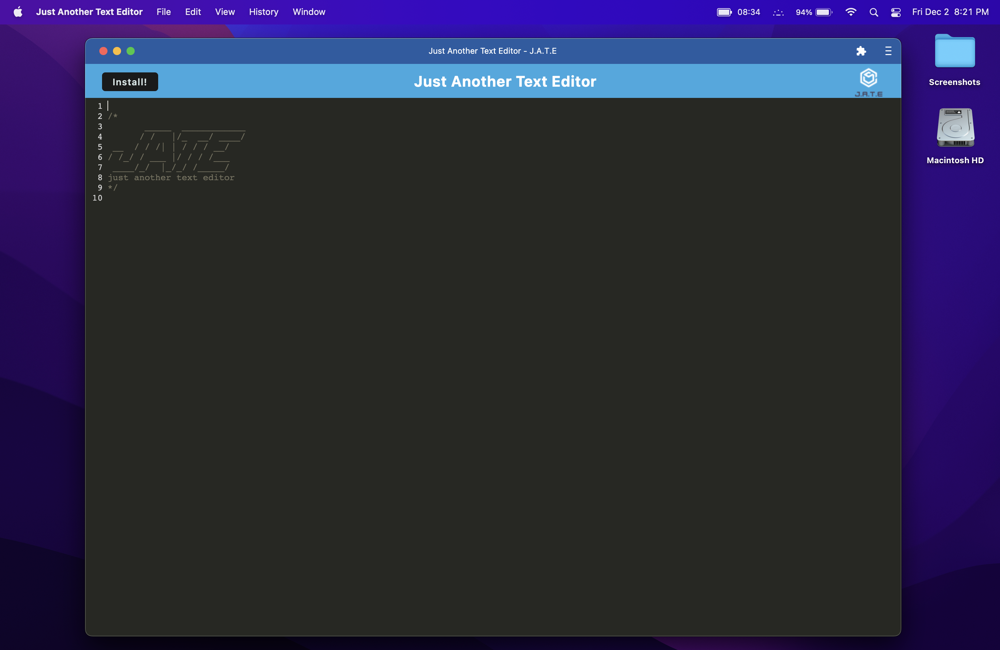
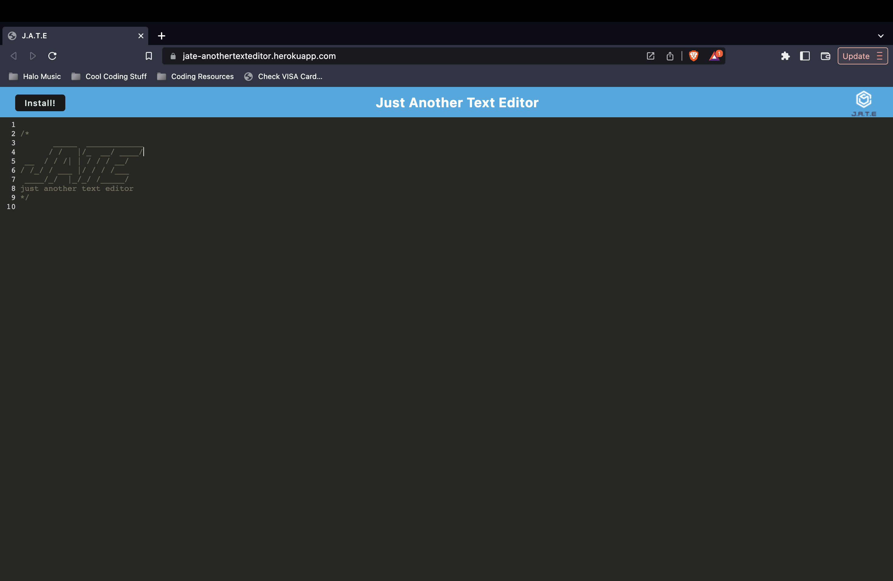

# 

# JATE - Just Another Text Editor

## Description
This is a text editor application that does just that! It allows you write out text (javascript will be color coded) and all text will be automatically saved to a database even if you lose internet or your computer shuts down! As long as your computer reconnects to the internet at some point, right when it does, all your text will be automatically stored in the database! This app is also downloadable via the install button on the page or using the browser's install button to right of the URL.

## Table of Contents
1. [Installation](#installation)
#
2. [Usage](#usage)
#
3. [License](#license)
#
4. [Contribute](#contributing)
#
5. [Tests](#tests)
#
6. [Screenshots](#screenshots)
#
7. [Questions](#questions)

(<a href="#mit-license">back to top</a>)

## Installation
#
To install this app, click the blue install button on the page or using the browser's install button to right of the URL.

(<a href="#mit-license">back to top</a>)

## Usage
#
Just navigate to the link at the bottom of this readme titled 'JATE' and it should take you right there. Next, enter whatever text you want in the editor, and marvel at how no matter what you do, the text will always store in the database.

(<a href="#mit-license">back to top</a>)

## License
#
[MIT License](https://opensource.org/licenses/MIT)

(<a href="#mit-license">back to top</a>)

## Contributing
#
Bfunk54/JATE-JustAnotherTextEditor

(<a href="#mit-license">back to top</a>)

## Tests
#
To install, clone the repo into your favorite code editor. Open the root folder in your terminal and run the command 'npm i' to install the needed dependencies to run this server. Now you should be able to run the command 'npm run start:dev' and it will build all the dependencies and bundles and the client and server should both start up.
To test, navigate to 'localhost:3000' in your favorite browser and you should be able to test all functionalities from there locally! Happy testing!

(<a href="#mit-license">back to top</a>)

## Screenshots
#

(<a href="mit-license">back to top</a>)

## Questions
#
Github: https://github.com/Bfunk54
#
Email me with any questions: ben_fein@icloud.com

(<a href="#mit-license">back to top</a>)

## Links
#
[JATE-JustAnotherTextEditor](https://jate-anothertexteditor.herokuapp.com/)
#
[Github Repo](https://github.com/Bfunk54/JATE-JustAnotherTextEditor)

(<a href="#mit-license">back to top</a>)

